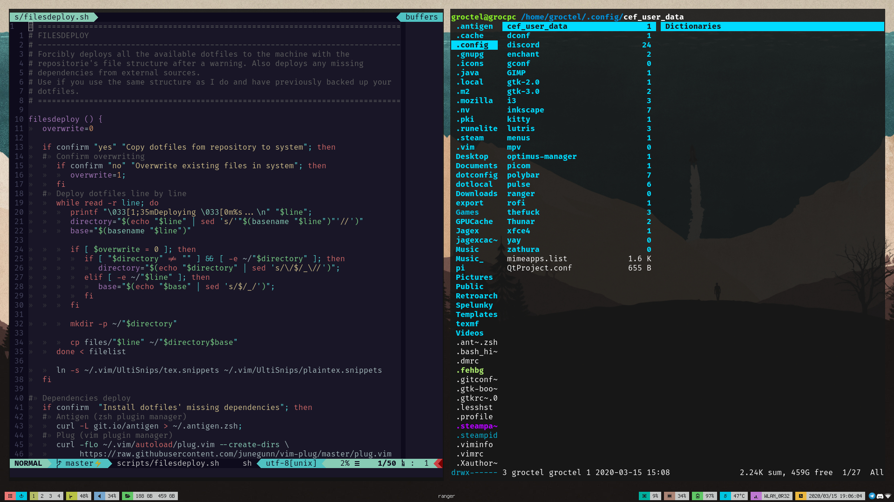

# Groctel's dotfiles

**Here are my dotfiles.
They are files made out of text on a directory tree with nothing.
Add them to your system if you want, I couldn't care less.** *Ron Swanson*

## Dotfiles manager

The files can be managed with `dotfiler.sh`, which accepts one of two arguments:

| ARGUMENT     | DESCRIPTION                                 |
| :----------- | :------------------------------------------ |
| `deploy`     | Deploys dotfiles to the system.             |
| `pkginstall` | Installs packages to the system with `yay`. |
| `pull`       | Copies dotfiles into the repository.        |

This script reads the dotfiles from both `filelist` and `filelist-root`, saves them to the repository and copies them into the home directory.
It also reads the packages from `pkglist`.

# Screenshots

